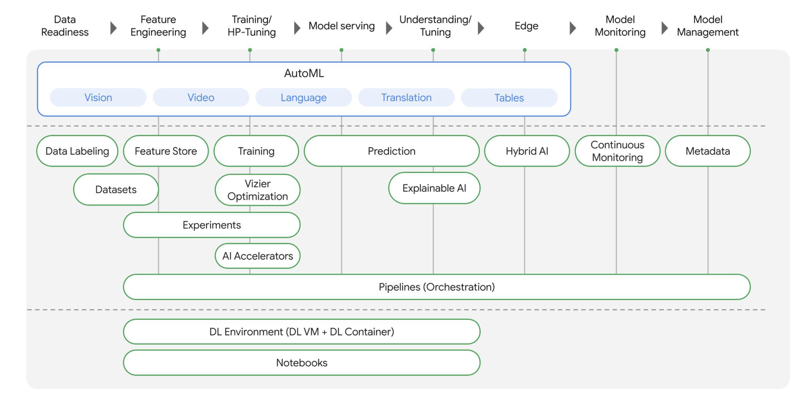
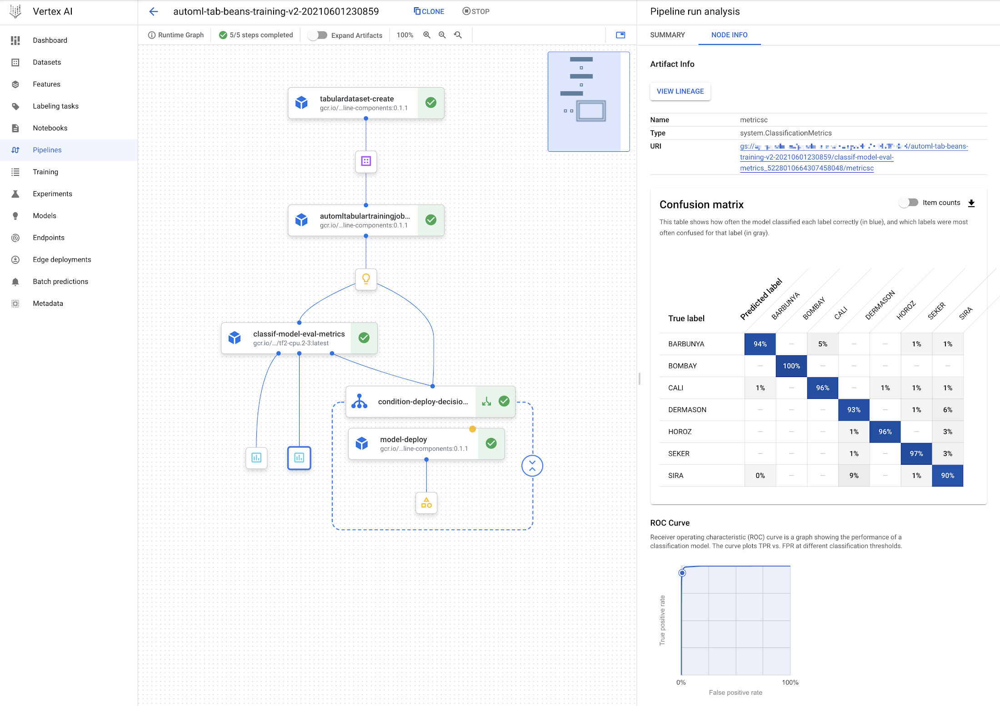
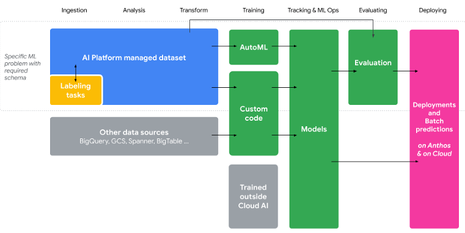
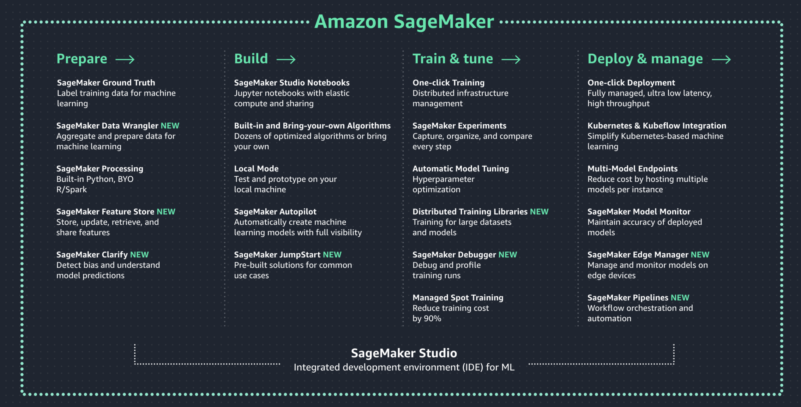
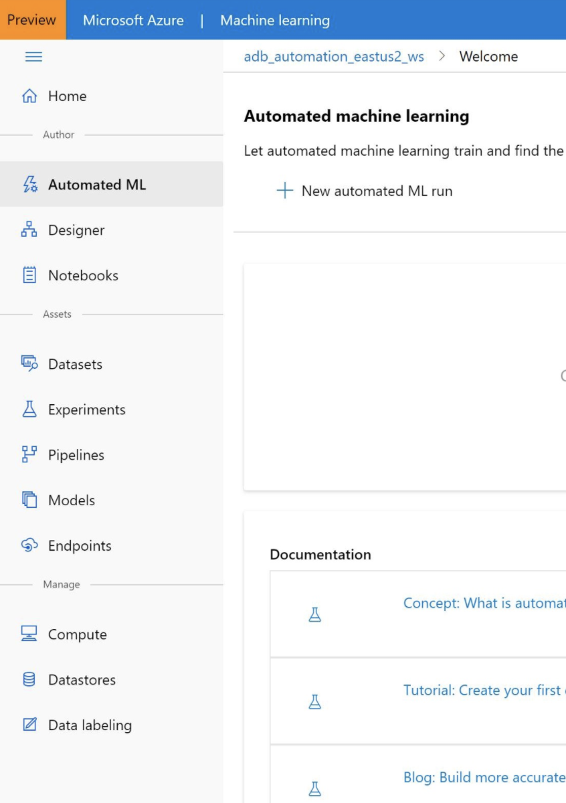

## Cloud Providers


- [Google](#google)
- [Amazon](#amazon)
- [Azure](#azure) 

### Intro

The big cloud providers offer a vast range of services and a lot of breadth in the MLOps space. These offerings can feel like a bundle of disconnected services until one sees the approach that holds it together. At a high level the cloud provider offerings can appear very similar but in detail each provider has a different set of services and a different approach to stitching them together.

Google&#39;s approach with Vertex is differentiated by the way it is structured, using Vertex pipelines as an orchestrator (Vertex pipelines being a managed and integrated version of open source kubeflow pipelines). AWS Sagemaker is differentiated primarily by the range of its services and how they relate to the rest of AWS. Microsoft&#39;s strategy with Azure centers on developer experience and quality of integrations.

### Google

Vertex is Google&#39;s [newly-unified](https://techcrunch.com/2021/05/18/google-cloud-launches-vertex-a-new-managed-machine-learning-platform/) AI platform. The main ways in which it is unified are:

- Everything falls logically under vertex headings in the google cloud console and the APIs to the services should be consistent. (Previously AutoML was [visibly a separate function](https://fuzzylabs.ai/blog/vertex-ai-the-hype/)).
- Pipelines can be used as an orchestrator for most of the workflow ([including AutoML](https://cloud.google.com/blog/topics/developers-practitioners/use-vertex-pipelines-build-automl-classification-end-end-workflow)).

#### Pipelines for Orchestration

This idea of pipelines as an orchestrator across offerings is illustrated here ([from TechCrunch](https://techcrunch.com/2021/05/18/google-cloud-launches-vertex-a-new-managed-machine-learning-platform/)):



This could be confusing to those familiar with kubeflow pipelines (which is [what vertex pipelines are under the hood](https://cloud.google.com/vertex-ai/docs/pipelines/build-pipeline)) as kubeflow pipelines started out as a distributed training system, with each step executing in a separate container, along with a UI to inspect runs and ways to resume from a failed step. Pipelines are usable for distributed training but pipelines can also be used to perform other tasks beyond training. This is illustrated in the below [screenshot](https://cloud.google.com/blog/topics/developers-practitioners/use-vertex-pipelines-build-automl-classification-end-end-workflow):

​​



Here there is a conditional deployment decision to decide whether the model is good enough to deploy or not. If it passes the test then the model is deployed from the pipeline.

#### Revamped AutoML

The AutoML offerings are now more consistent with other parts of Google&#39;s AI stack. Basically different ways to input your data can lead to the same training path and different training paths can lead to the same deployment path. Here&#39;s a diagram from Henry Tappen and Brian Kobashikawa ([via Lak Lakshmanan](https://towardsdatascience.com/giving-vertex-ai-the-new-unified-ml-platform-on-google-cloud-a-spin-35e0f3852f25)):



There is also some difference, as can be seen in how datasets are handled. The dataset concept is broken into managed (which has specific metadata and lives on [specific google data products](https://towardsdatascience.com/giving-vertex-ai-the-new-unified-ml-platform-on-google-cloud-a-spin-35e0f3852f25)) or not managed. The managed datasets [are mostly for just AutoML for now](https://cloud.google.com/vertex-ai/docs/training/code-requirements).

#### Training Models

We could think of Google as having three basic routes to training models - AutoML, pipelines (which is intended more as an orchestrator) and [custom training jobs](https://cloud.google.com/vertex-ai/docs/training/code-requirements). Where pipelines use multiple containers with each step in a different container, custom training jobs are a single-container training function. It has automatic [integration to TensorBoard](https://cloud.google.com/vertex-ai/docs/experiments/tensorboard-training) for results. It can do distributed training via the underlying ML code framework, [providing the framework supports it](https://cloud.google.com/vertex-ai/docs/training/distributed-training). It supports GPUs and you can [watch/inspect runs](https://cloud.google.com/vertex-ai/docs/training/monitor-debug-interactive-shell), though inspecting runs looks a bit basic compared to pipelines.

There&#39;s a facility [native to the custom training jobs for tuning](https://cloud.google.com/vertex-ai/docs/vizier/overview#how_differs_from_custom_training) hyperparameters. In addition to this, google has launched Vizier. Instead of being native to training jobs Vizier has an API and you tell it what you&#39;ve tried and it makes suggestions for what to try next. This may be less integrated but Vizier is [able to go deeper](https://cloud.google.com/vertex-ai/docs/vizier/overview#how_differs_from_custom_training) in what it can tune.

#### Deployment

To deploy your models to get predictions, you have two options. If your model is built using a [natively supported framework](https://cloud.google.com/vertex-ai/docs/predictions/pre-built-containers), you can tell google to load your model (serialized artifact) into a pre-built container image. If your model framework is not supported or you have custom logic then you can supply a [custom image meeting the specification](https://cloud.google.com/vertex-ai/docs/predictions/custom-container-requirements). Google can then [create an endpoint](https://cloud.google.com/vertex-ai/docs/predictions/deploy-model-console#custom-trained) for you to call to get predictions. You can create this either through the API or using the web console wizard.

#### Monitoring

Running models can be monitored for training/serving skew. For skew you supply your training set when you [create the monitoring job](https://colab.research.google.com/github/GoogleCloudPlatform/vertex-ai-samples/blob/master/notebooks/official/model_monitoring/model_monitoring.ipynb#scrollTo=XV-vru2Pm1oX). The monitoring job stores data going into your model in a storage bucket and uses this for comparison to the training data. You can get alerts based on configurable thresholds for individual features. Drift is similar but [doesn&#39;t require training data](https://cloud.google.com/vertex-ai/docs/model-monitoring/using-model-monitoring?hl=nb#analyzing-skew-drift) (it&#39;s monitoring change over time). Feature [distributions are shown in the console](https://cloud.google.com/vertex-ai/docs/model-monitoring/using-model-monitoring?hl=nb#analyzing-skew-drift) for any alerts.

### Amazon

SageMaker aims to be both comprehensive and integrated. It has services addressed at all parts of the ML lifecycle and a variety of ways to interact with them, including its own dedicated web-based IDE (SageMaker Studio - [based on JupyterLab](https://docs.aws.amazon.com/sagemaker/latest/dg/studio-ui.html)).



The services marked as &#39;New&#39; in the above were mostly announced at re:invent in December 2020.

#### Prepare

SageMaker Ground Truth is a labelling service, [similar to Google&#39;s](https://cloud.google.com/vertex-ai/docs/datasets/data-labeling-job) but with more automation features and less reliance on humans. SageMaker Ground Truth&#39;s automation makes it competitive with [specialist labelling tools](https://neptune.ai/blog/data-labeling-software) (a [whole area in itself](https://anthony-sarkis.medium.com/the-5-best-ai-data-annotation-platforms-for-machine-learning-2021-ec17c15142f3#de98)).

Data Wrangler allows data scientists to visualize, transform and analyze data from supported data sources from within SageMaker Studio:


Data Wrangler is also integrated with [Clarify](https://aws.amazon.com/sagemaker/clarify/) (which handles explainability), to highlight bias in data. This streamlines feature engineering and the resulting features can go directly to SageMaker Feature Store. Custom code can be added and SageMaker also separately has support for [Spark processing jobs](https://docs.aws.amazon.com/sagemaker/latest/dg/processing-job.html).

Once features are in the Feature Store, they are available to be searched for and used by other teams. They can also be used at the serving stage as well as the training stage.

#### Build

The &#39;Build&#39; heading is for offerings that save time throughout the whole process. [AutoPilot](https://aws.amazon.com/sagemaker/autopilot/) is SageMaker&#39;s AutoML service that covers automated feature engineering, model building and selection. The various models it builds are all visible so you can evaluate them and choose which to deploy.

JumpStart is a set of CloudFormation templates for common ML use cases.

#### Train and Tune

Training with SageMaker is typically done from the python sdk, which is used to invoke training jobs. A training job runs inside a container on an EC2 instance. You can use a [pre-built docker image](https://docs.aws.amazon.com/sagemaker/latest/dg/docker-containers.html) if your training job is for a natively supported [algorithm](https://docs.aws.amazon.com/sagemaker/latest/dg/algos.html) and framework. Otherwise you can use your [own docker image](https://towardsdatascience.com/deploying-a-custom-docker-model-with-sagemaker-to-a-serverless-front-end-with-s3-8ee07edc24e6) that conforms to the [requirements](https://docs.aws.amazon.com/sagemaker/latest/dg/your-algorithms-training-algo-dockerfile.html). The SDK can also be used for [distributed training jobs](https://sagemaker-examples.readthedocs.io/en/latest/training/distributed_training/pytorch/data_parallel/mnist/pytorch_smdataparallel_mnist_demo.html) for frameworks that support distributed training.

Processing and training steps can be chained together in [Pipelines](https://docs.aws.amazon.com/sagemaker/latest/dg/build-and-manage-steps.html). The resulting models can be [registered](https://docs.aws.amazon.com/sagemaker/latest/dg/build-and-manage-steps.html#step-type-register-model) in the model registry and you can [track lineage](https://docs.aws.amazon.com/sagemaker/latest/dg/pipelines.html) on artifacts from steps. You can also [view and execute pipelines](https://docs.aws.amazon.com/sagemaker/latest/dg/pipelines-studio.html) from the SageMaker Studio UI.

#### Deploy and Manage

The SageMaker SDK has a &#39;deploy&#39; operation for which you specify what type of instance you want your model deployed to. As with training, this can be either a custom image or a built-in one. The expectation is training and deployment will both happen with SageMaker but this [can be worked around](https://towardsdatascience.com/deploying-a-custom-docker-model-with-sagemaker-to-a-serverless-front-end-with-s3-8ee07edc24e6) if you want to deploy a model that you&#39;ve trained outside of SageMaker. Serving real-time HTTP requests is the typical case but you can also perform [batch](https://docs.aws.amazon.com/sagemaker/latest/dg/batch-transform.html#batch-transform-large-datasets) predictions and chain inference steps in [inference pipelines](https://docs.aws.amazon.com/sagemaker/latest/dg/inference-pipelines.html).

Deployed models get some monitoring by default with integration to CloudWatch for basic invocation metrics. You can also set up [scheduled monitoring jobs](https://docs.aws.amazon.com/sagemaker/latest/dg/model-monitor-scheduling.html). SageMaker can be configured to [capture request and response data](https://docs.aws.amazon.com/sagemaker/latest/dg/model-monitor-data-capture.html) and to perform various comparisons on that data such as comparing against training data or triggering alerts based on constraints.

### Azure

The Azure Machine Learning offering is consciously pitched at multiple roles (especially Data Scientists and Developers) and different skill levels. It is aimed to support team collaboration and automate the key problems of MLOps, across the whole ML lifecycle. This comes across in the prominence Azure gives to [workspaces](https://docs.microsoft.com/en-us/azure/machine-learning/how-to-manage-workspace?tabs=python) and [git repos](https://docs.microsoft.com/en-us/azure/machine-learning/concept-train-model-git-integration) and there&#39;s also increasing support for [Azure ML with VSCode](https://visualstudiomagazine.com/articles/2021/05/05/vscode-azureml.aspx) (along with the web-based GUI called Studio).

The cloud providers are all looking to leverage existing relationships in their MLOps offerings. For Microsoft this appears to be about developer relationships (with GitHub and VSCode) as well as a reputation as a compute provider. They seem keen on integrations and [references to open source tools](https://docs.microsoft.com/en-us/azure/machine-learning/concept-open-source) and integrations to the Databricks platform are prominent in the documentation.

#### Workspaces


 With Azure Machine Learning everything belongs to a workspace by default and workspaces can be shared between users and teams. The assets under a workspace are shown in the [studio web UI](https://docs.microsoft.com/en-us/azure/machine-learning/overview-what-is-machine-learning-studio).



Let&#39;s walk through the key Azure ML concepts to get a feel for the platform.
#### Datasets
Datasets are references to where data is stored. The data itself isn&#39;t in the workspace but the dataset abstraction lets you work with the data through the workspace. Only metadata is copied to the workspace. Datasets can be [FileDataSets or TabularDataSets](https://docs.microsoft.com/en-us/azure/machine-learning/how-to-create-register-datasets#dataset-types). The data can be on a range of supported types of storage, including [blob storage, databases or the Databricks file system](https://docs.microsoft.com/en-us/azure/machine-learning/how-to-access-data#supported-data-storage-service-types).
#### Environments
An environment is a configuration with variables and library dependencies, used for [training and for serving models](https://docs.microsoft.com/en-us/azure/machine-learning/concept-environments). Plays a similar role to pipenv but is instantiated through docker under the hood. 

#### Experiments

Experiments are groups of training runs. Each time we train a model with a set of parameters, that falls under an experiment that can be automatically recorded. This allows us to review what was trained when and by whom. Here&#39;s a [simple script](https://docs.microsoft.com/en-us/azure/machine-learning/how-to-use-environments#use-environments-for-training) to submit a training run with the Azure ML Python SDK:

```python
from azureml.core import ScriptRunConfig, Experiment
from azureml.core.environment import Environment

exp = Experiment(name="myexp", workspace = ws)
# Instantiate environment
myenv = Environment(name="myenv")

# Configure the ScriptRunConfig and specify the environment
src = ScriptRunConfig(source_directory=".", script="train.py", compute_target="local", environment=myenv)

# Submit run 
run = exp.submit(src)
```

Here we&#39;re referring to another script called &quot;train.py&quot; that contains typical model training code, [nothing azure-specific](https://docs.microsoft.com/en-us/azure/machine-learning/tutorial-1st-experiment-sdk-train). We name the experiment that will be used and also name the environment. Both are instantiated automatically and the submit operation runs the training job.

The above is [run from the web studio](https://docs.microsoft.com/en-us/azure/machine-learning/tutorial-1st-experiment-hello-world) with the files in the cloud already. Training can also be run from a notebook or from local by having the CLI configured and submitting a [CLI command with a YAML specification](https://docs.microsoft.com/en-us/azure/machine-learning/how-to-train-cli) for the environment image and to point to the code.

Training parameters and metrics can be automatically logged as [Azure integrates with mlflow&#39;s open source approach to tracking](https://docs.microsoft.com/en-us/azure/machine-learning/how-to-train-cli). If you submit a run from a directory under git then [git information is also tracked for the run](https://docs.microsoft.com/en-us/azure/machine-learning/concept-train-model-git-integration).

#### Pipelines

Azure [Machine Learning Pipelines](https://docs.microsoft.com/en-us/azure/machine-learning/concept-ml-pipelines) are for training jobs that have multiple long-running steps. The steps can be chained to run in different containers so that some can run in parallel and if an individual step fails then you can retry/resume from there.

#### Models

[Models](https://docs.microsoft.com/en-us/azure/machine-learning/concept-azure-machine-learning-architecture#models) are either created in Azure through training runs or you can register models created elsewhere. A registered model can be deployed as an endpoint.

#### Endpoints

An endpoint sets up hosting so that you can make requests to your model in the cloud and get predictions. Endpoint hosting is inside a [container image](https://docs.microsoft.com/en-us/azure/machine-learning/concept-compute-target#deploy) - so basically an Environment, which could be the same image/Environment used for training. There are some [prebuilt images available](https://docs.microsoft.com/en-us/azure/machine-learning/concept-prebuilt-docker-images-inference) to use as [a basis](https://docs.microsoft.com/en-us/azure/machine-learning/how-to-extend-prebuilt-docker-image-inference). Or you can build an image from scratch that [conforms to the requirements](https://docs.microsoft.com/en-us/azure/machine-learning/how-to-deploy-custom-container).

[Azure ML&#39;s managed endpoints](https://docs.microsoft.com/en-us/azure/machine-learning/concept-endpoints) have traffic-splitting [features](https://docs.microsoft.com/en-us/azure/machine-learning/how-to-deploy-managed-online-endpoints) for rollout and can work with GPUs. Inference can be real-time or batch. There&#39;s also integration to [monitoring](https://docs.microsoft.com/en-us/azure/machine-learning/how-to-monitor-online-endpoints) features. Managed endpoints and monitoring are both in Preview/Beta release at the time of writing.
